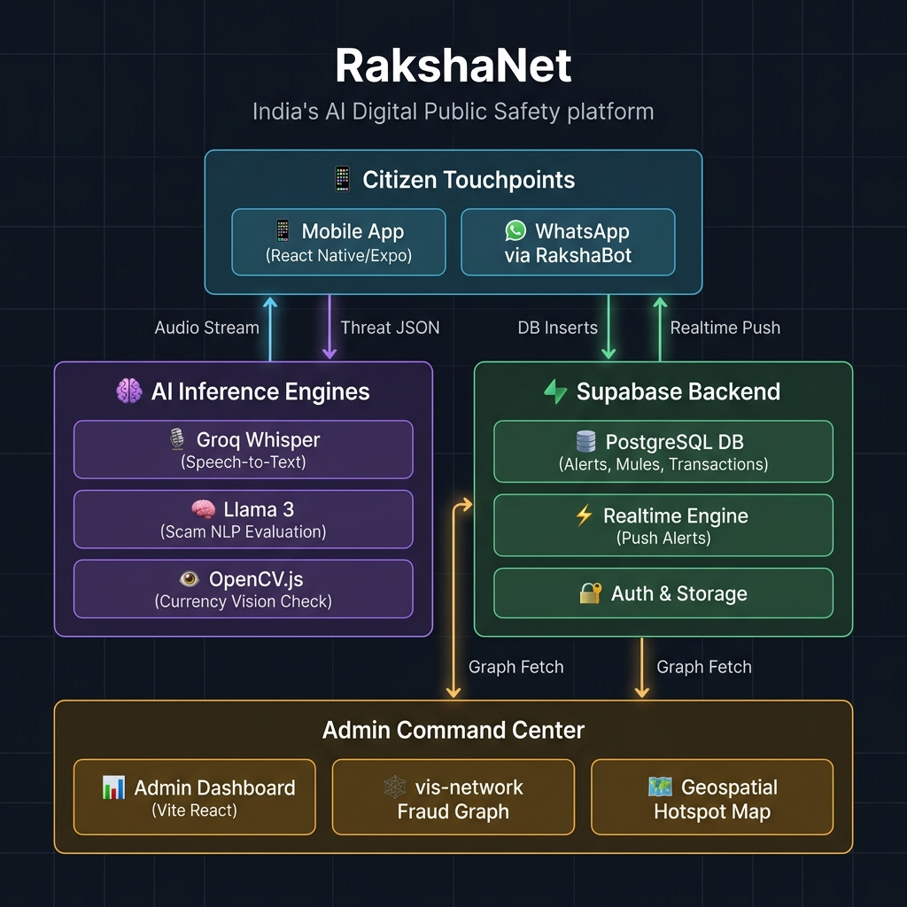
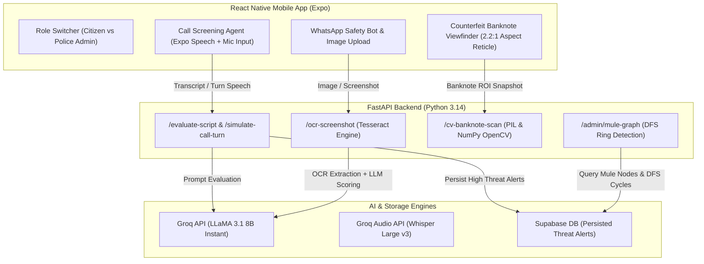
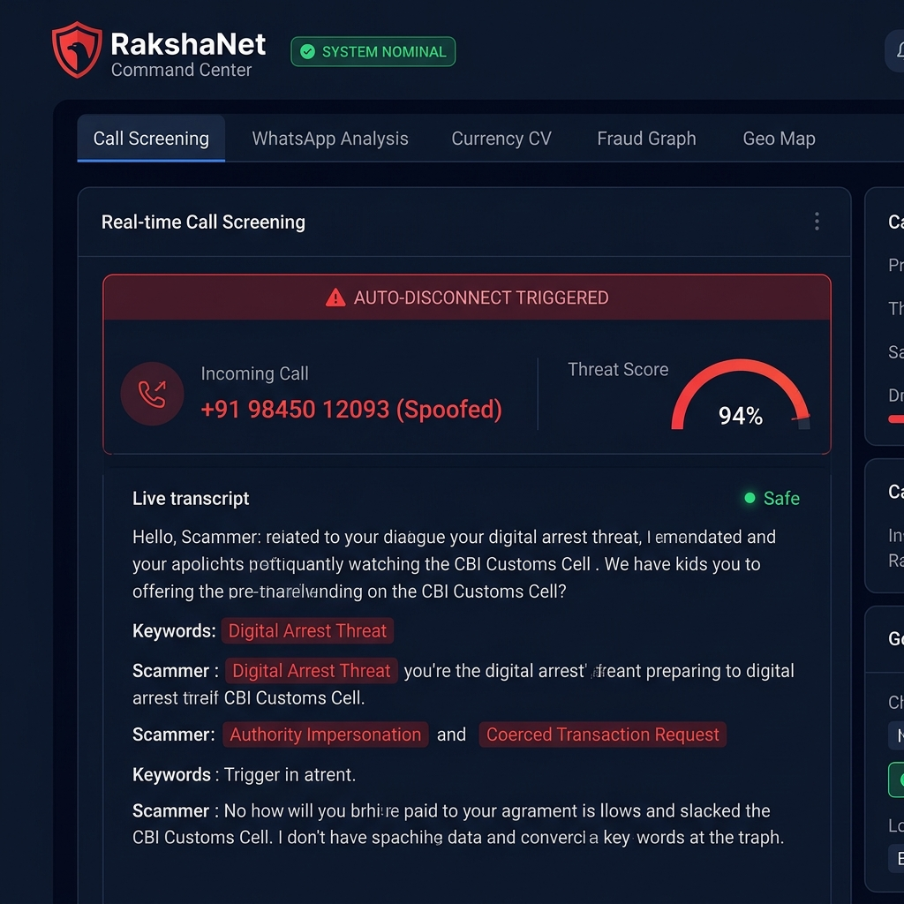
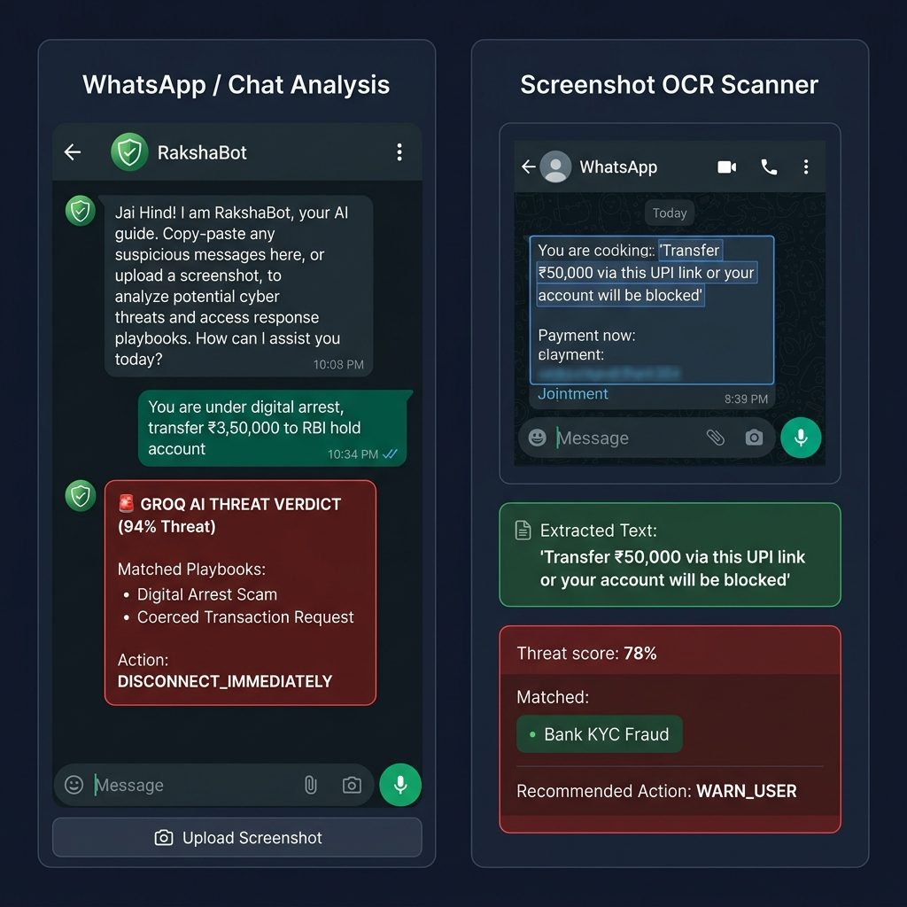
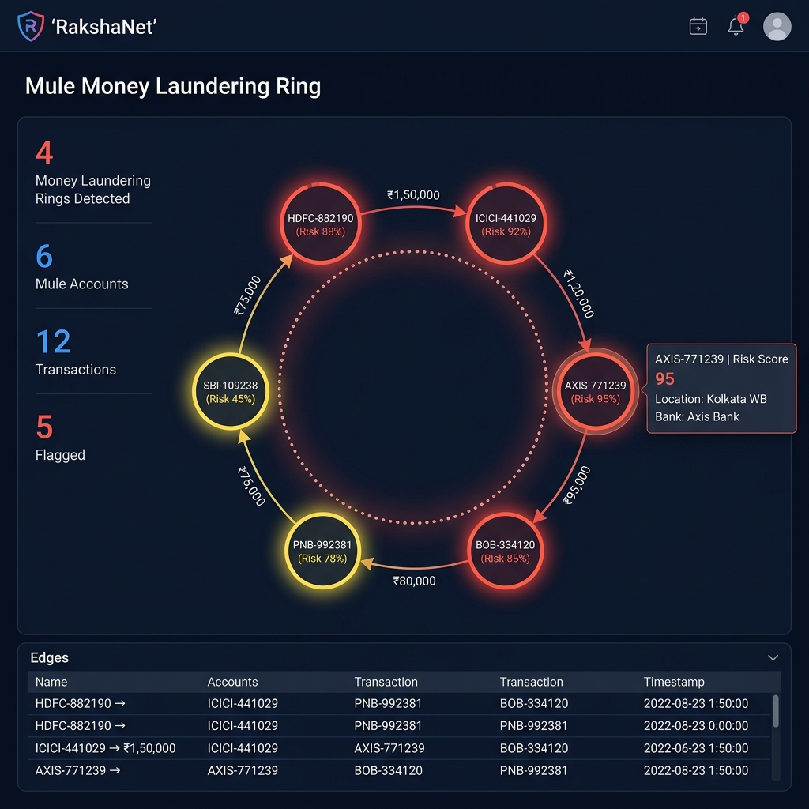
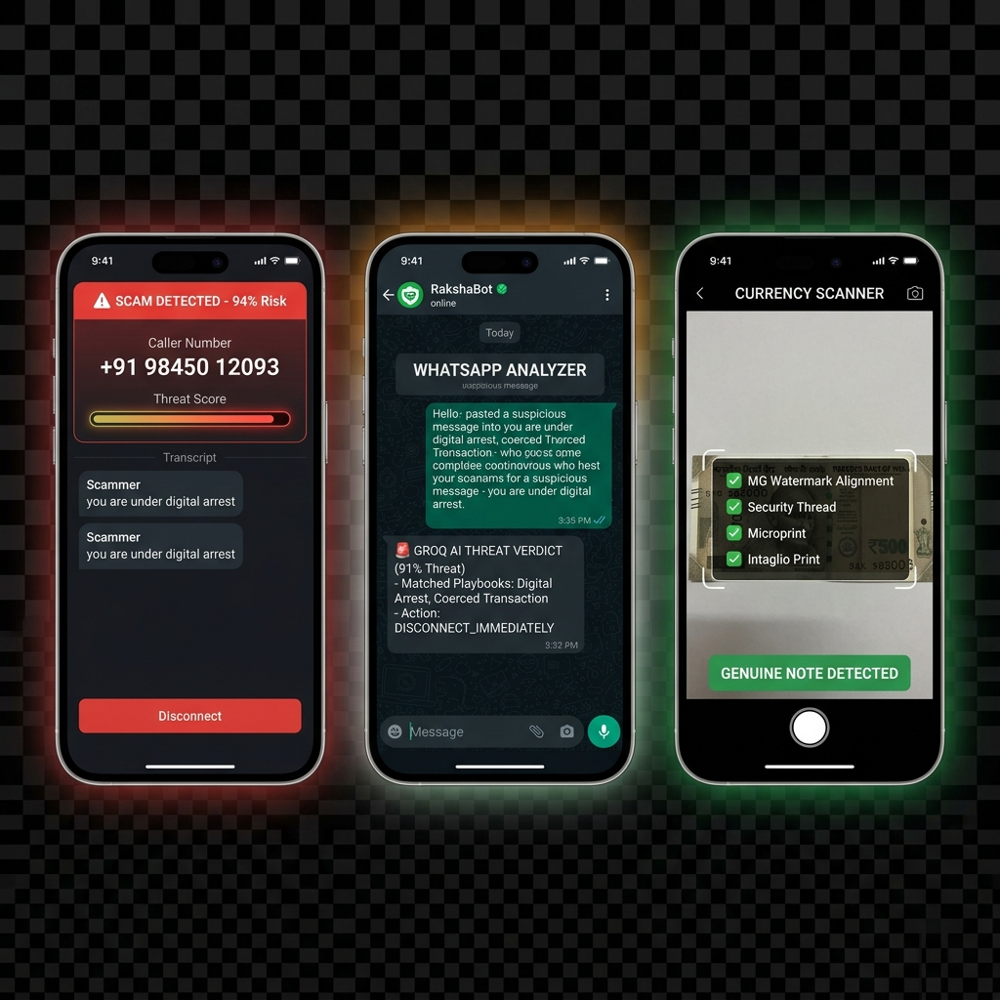

# 🛡️ RakshaNet: Unified AI-Powered Digital Public Safety & Cyber Fraud Prevention Platform

> **Economic Times AI Hackathon 2026**
> *Problem Statement PS6: Digital Public Safety — Protecting Indian Citizens from Cyber Fraud in Real-Time*

---

## 📌 Executive Summary

India loses over **₹1,750 Crore annually** to digital cybercrime, with threat types like *Digital Arrest Scams*, *Utility Bill Disconnection Frauds*, *Bank KYC / OTP Exploits*, and *Counterfeit Currency Notes* trapping thousands of citizens daily.

**RakshaNet** is a proactive, AI-first public safety platform that transitions cybersecurity from *reactive reporting* to *real-time defense*. It operates a dual-app architecture:
1. **Citizen Mobile App (`/mobile`)**: A React Native (Expo) app providing live call screening, WhatsApp chat/screenshot auditing, and camera-based counterfeit note verification.
2. **Admin Command Center (`/admin`)**: A Vite-React web app for law enforcement and bank analysts to monitor real-time alerts, visualize transaction networks, and detect money laundering rings.

---

## 🏛️ System Architecture & Workflow





```
┌──────────────────────────────────────────────┐
│            CITIZEN TOUCHPOINTS               │
│  📱 Mobile App (Expo)  │  💬 WhatsApp Bot    │
└───────────────┬─────────────────┬────────────┘
                │                 │
                ▼                 ▼
┌──────────────────────────────────────────────┐
│          FASTAPI BACKEND (Python)             │
│  /transcribe  /evaluate-script  /ocr          │
│  /process-call-chunk  /fraud-graph            │
└────────────────────┬─────────────────────────┘
          ┌──────────┴──────────┐
          ▼                     ▼
┌─────────────────┐   ┌─────────────────────────┐
│  GROQ AI CLOUD  │   │  SUPABASE (PostgreSQL)   │
│  Whisper STT    │   │  alerts / mule_accounts  │
│  Llama 3 NLP    │   │  transactions / realtime │
└─────────────────┘   └────────────┬────────────┘
                                   │ Realtime WebSocket
                                   ▼
                    ┌──────────────────────────┐
                    │  ADMIN COMMAND CENTER    │
                    │  Vite + React Dashboard  │
                    │  vis-network Fraud Graph │
                    │  Geospatial Hotspot Map  │
                    └──────────────────────────┘
```

---

## 🎯 Core Features & Technical Implementation

### 1. 📞 Real-Time Call Screening & Intercept Agent
*   **Speech-to-Text**: Captures live call audio chunks from the microphone and streams them to Groq's **Whisper-large-v3** for transcription in `<200ms`.
*   **Turn-Based AI Voice Engine**: Synthesizes incoming caller speech using `expo-speech` while listening for citizen response.
*   **Dynamic Scam Escalation**: Integrates `/simulate-call-turn` on Groq LLaMA 3.1 to generate live scammer dialog turns based on citizen replies.
*   **Automated Intercept**: Evaluates threat indices on every turn. When threat probability exceeds **80%** (or $88\%$ depending on tuning), the system triggers a native phone vibration pattern and **auto-disconnects** the call to protect the user from coerced transactions, presenting an explainable threat audit report.



---

### 2. 💬 WhatsApp Chat & Screenshot OCR Audit
*   **Chatpaste Analyzer**: Allows users to copy-paste suspicious conversation logs directly to **RakshaBot** for a natural language digital security audit (supporting English/Hindi).
*   **In-Chat Thumbnail Previews**: Renders uploaded attachment thumbnails directly inside message bubbles.
*   **OCR Screenshot Scanning**: Uses a **Pytesseract** engine to extract text from payment request screenshots, scanning them for banking fraud triggers, remote desktop installation threats (AnyDesk, QuickSupport), and fake UPI links.



---

### 3. 📷 Counterfeit Currency Computer Vision Check
*   Checks security features on ₹500 and ₹2000 currency notes using a local webcam feed or native mobile camera.
*   **2.2:1 Currency Viewfinder**: Aligns the camera frame to standard Indian banknote proportions.
*   **Central ROI Cropping**: Automatically crops the central 75% width × 55% height Region of Interest (ROI) to eliminate background table/room noise.
*   **Spatial Feature Analysis**:
    *   ✅ **Security Thread Shift**: Computes RGB color channel variance ($std(G - R) \ge 4.2$) across metallic thread regions.
    *   ✅ **Watermark & Intaglio Edge Contrast**: Applies Sobel edge filter analysis ($mean \ge 4.0$, $std \ge 6.5$) to verify Gandhi portrait watermarks and micro-text line density.
    *   ✅ Intaglio printing latent image presence.

---

### 4. 🕸️ Fraud Graph & Money Laundering Loop Detection
*   **Visualizer**: Built with `vis-network` to map relationships between victims, transactions, and suspicious bank accounts.
*   **Loop Finder**: A custom Python **Depth-First Search (DFS)** algorithm running on the backend detects circular laundering routes (e.g., Account A ➔ B ➔ C ➔ A) up to 8 hops deep, flag-marking active mule networks for banks and cyber police.
*   **Mule Account Registry**: Provides law enforcement with 1-click emergency lien hold signals to freeze compromised bank accounts.



---

### 5. 🗺️ Geospatial Crime Hotspot Map
*   Displays geographical clustering of reported incidents, active phone spoofing cells (such as Jamtara and Mewat clusters), and local arrests, filtered dynamically by incident type.

---

## 📱 Mobile App Screen Previews

Here is a preview of the citizen-facing interface screens showing real-time call screening, WhatsApp safety chatbot checks, and currency verification logic:



---

## 📁 Repository Structure

```
ET_GENAI/
├── admin/                      # Vite + React Admin Command Center Dashboard
├── assets/                     # Architecture & dashboard preview images
├── backend/                    # FastAPI Backend Application
│   ├── main.py                 # Application entrypoint & CORS middleware
│   ├── requirements.txt        # Python dependencies
│   ├── db/                     # Database migrations & seed scripts
│   ├── lib/
│   │   ├── config.py           # Environment variables configuration
│   │   ├── groq_client.py      # Groq LLaMA 3.1 & Whisper integration
│   │   └── supabase_client.py  # Supabase client wrapper
│   └── routes/
│       ├── banknote.py         # CV banknote verification & ROI crop
│       ├── evaluate.py         # Call evaluation & dynamic turn generator
│       ├── fraud_graph.py      # Mule account DFS graph algorithms
│       ├── ocr.py              # Tesseract OCR screenshot parser
│       └── transcribe.py       # Audio whisper transcription endpoint
│
├── mobile/                     # React Native Mobile Application (Expo)
│   ├── App.tsx                 # Unified Citizen & Police Admin UI
│   ├── package.json            # React Native dependencies (expo-speech, expo-camera)
│   ├── tsconfig.json           # TypeScript configuration
│   └── assets/                 # App icon & splash image assets
│
├── PS6_Digital_Public_Safety_Deep_Analysis.pdf  # Technical problem deep-dive
└── README.md                   # System documentation
```

---

## 💻 Local Setup & Execution Guide

### Prerequisites
- **Python 3.11+** installed
- **Node.js 18+ & npm** installed
- **Tesseract OCR** installed on system (Windows: `C:\Program Files\Tesseract-OCR\tesseract.exe`)

---

### 1. Backend Setup (FastAPI)

```bash
# Navigate to backend directory
cd backend

# Create virtual environment
python -m venv venv

# Activate virtual environment
# Windows:
.\venv\Scripts\activate
# Linux/macOS:
source venv/bin/activate

# Install dependencies
pip install -r requirements.txt

# Environment configuration
# Create .env file with your API keys:
# GROQ_API_KEY=your_groq_api_key
# SUPABASE_URL=your_supabase_url
# SUPABASE_KEY=your_supabase_key

# Seed initial database records:
python db/seed.py

# Run FastAPI server
python main.py
```
The backend server will start at `http://localhost:8000`. Interactive Swagger documentation is available at `/docs`.

---

### 2. Admin Command Center Setup (React Vite)

```bash
# Navigate to admin directory
cd admin

# Install dependencies
npm install

# Run Vite development server
npm run dev
```
Access the web panel at `http://localhost:5173`.

---

### 3. Mobile App Setup (React Native Expo)

```bash
# Navigate to mobile directory
cd mobile

# Install dependencies
npm install

# Start Expo development server
npm start
```
Scan the QR code using **Expo Go** on Android/iOS or run on an emulator.

---

## 🔌 Backend API Reference

**Base URL:** `http://localhost:8000`

| Method | Route | Description | Authentication |
|--------|-------|-------------|----------------|
| `GET`  | `/health` | Check Supabase + Groq connectivity and service health | None |
| `GET`  | `/` | List all endpoints and version metadata | None |
| `POST` | `/transcribe` | Audio file ➔ Whisper transcript string | None |
| `POST` | `/evaluate-script` | Text transcript ➔ Scam threat evaluation JSON | None |
| `POST` | `/process-call-chunk` | Combined endpoint: transcribe audio + run LLM threat check | None |
| `POST` | `/ocr-screenshot` | Upload image screenshot ➔ OCR text ➔ Scam verdict | None |
| `GET`  | `/fraud-graph` | Fetch all mule nodes, transactions, and DFS cycle rings | None |
| `POST` | `/banknote` | Image upload ➔ Counterfeit computer vision validation | None |

---

## 🗄️ Database Schema (Supabase)

The platform utilizes three primary tables in Supabase (PostgreSQL) with Realtime replication enabled:

| Table Name | Primary Columns | Purpose |
|------------|-----------------|---------|
| **`alerts`** | `id`, `call_id`, `threat_score`, `matched_patterns`, `reasoning`, `recommended_action`, `created_at` | Persists high-threat scam instances (score > 65) for Admin Dashboard notifications. |
| **`mule_accounts`** | `id`, `account_number_hash`, `risk_score`, `bank`, `location` | Known or flagged bank accounts used in laundering. |
| **`transactions`** | `id`, `from_account`, `to_account`, `amount`, `is_flagged`, `ts` | Record of transfers between mule accounts analyzed by DFS. |

---

## ⚡ Tech Stack Details

*   **API Gateway**: FastAPI (Python)
*   **Real-time Push**: Supabase Realtime (WebSockets)
*   **STT Models**: Groq Whisper-large-v3
*   **LLM Classifier**: Groq Llama-3.1-8b-instant
*   **OCR Scanning**: Tesseract OCR
*   **Database**: PostgreSQL (Supabase)
*   **Frontends**: React (Web), React Native Expo (Mobile)

---

## 🔒 Security & Privacy Features

- **Local Region-of-Interest Processing**: Camera frames are cropped client-side/backend ROI before processing to strip ambient environment pixels.
- **RBAC Segmentation**: Role-Based Access Control separates citizen view features from sensitive police administrative analytics.
- **Fail-Safe Fallbacks**: Local heuristic rules ensure continuous protection even during network latency or API downtime.

---

*Developed for the Economic Times AI Hackathon 2026.*
*RakshaNet: Digital Public Safety for India.*
