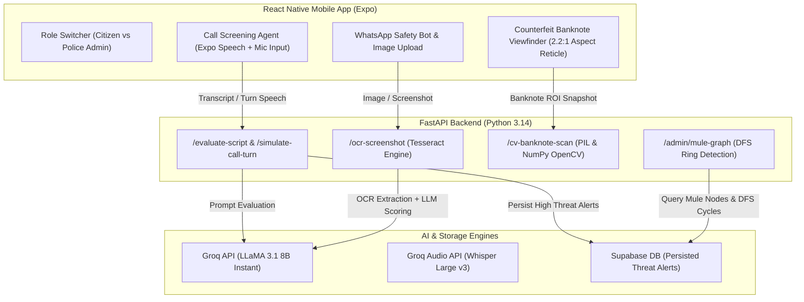

# RakshaNet Unified: AI-Powered Digital Public Safety & Cyber Fraud Prevention Platform

RakshaNet Unified is an end-to-end digital public safety platform designed to protect citizens against Indian cybercrime threat vectors, including **Digital Arrest Scams**, **Utility Bill Disconnection Frauds**, **Bank KYC / OTP Exploits**, and **Counterfeit Currency Notes**.

The system combines a mobile application for citizens, an administrative center for law enforcement officers, real-time AI audio/text evaluation, computer vision feature extraction, and graph-based money laundering ring detection.

---

## 🏛️ System Architecture & Workflow



---

## 🚀 Key Modules & Technical Implementation

### 1. 📞 Real-Time Call Screening & Intercept Agent
- **Turn-Based AI Voice Engine**: Synthesizes incoming caller speech using `expo-speech` while listening for citizen response.
- **Dynamic Scam Escalation**: Integrates `/simulate-call-turn` on Groq LLaMA 3.1 to generate live scammer dialog turns based on citizen replies.
- **Automated Intercept**: Evaluates threat indices on every turn. When threat probability exceeds $88\%$, the app triggers warning vibration patterns and terminates the call connection, presenting an explainable threat audit report.

### 2. 💬 WhatsApp Public Safety Assistant & Screenshot OCR
- **Natural Language Inquiry**: Answers citizen queries in English/Hindi regarding digital security.
- **In-Chat Thumbnail Previews**: Renders uploaded attachment thumbnails directly inside message bubbles.
- **Tesseract OCR Engine**: Extracts structured text from uploaded WhatsApp chat screenshots and runs threat heuristic pattern matching against known Indian cybercrime playbooks.

### 3. 💵 Computer Vision Counterfeit Banknote Authenticator
- **2.2:1 Currency Viewfinder**: Aligns the camera frame to standard Indian banknote proportions (₹500 / ₹200 / ₹100).
- **Central ROI Cropping**: Automatically crops the central 75% width × 55% height Region of Interest (ROI) to eliminate background table/room noise.
- **Spatial Feature Analysis**:
  - **Security Thread Shift**: Computes RGB color channel variance ($std(G - R) \ge 4.2$) across metallic thread regions.
  - **Watermark & Intaglio Edge Contrast**: Applies Sobel edge filter analysis ($mean \ge 4.0$, $std \ge 6.5$) to verify Gandhi portrait watermarks and micro-text line density.

### 4. 🛡️ Police Admin Center (RBAC)
- **Mule Ring Graph Center**: Applies Depth-First Search (DFS) cycle detection across bank transfer nodes to highlight circular money laundering loops.
- **Mule Account Registry**: Provides law enforcement with 1-click emergency lien hold signals to freeze compromised bank accounts.

---

## 📁 Repository Structure

```
ET_GENAI/
├── backend/                    # FastAPI Backend Application
│   ├── main.py                 # Application entrypoint & CORS middleware
│   ├── requirements.txt        # Python dependencies
│   ├── lib/
│   │   ├── config.py           # Environment variables configuration
│   │   ├── groq_client.py      # Groq LLaMA 3.1 & Whisper integration
│   │   └── supabase_client.py  # Supabase client wrapper
│   └── routes/
│       ├── banknote.py         # CV banknote verification & ROI crop
│       ├── evaluate.py         # Call evaluation & dynamic turn generator
│       ├── fraud_graph.py      # Mule account DFS graph algorithms
│       ├── ocr.py              # Tesseract OCR screenshot parser
│       └── transcribe.py       # Audio whisper transcription endpoint
│
├── mobile/                     # React Native Mobile Application (Expo)
│   ├── App.tsx                 # Unified Citizen & Police Admin UI
│   ├── package.json            # React Native dependencies (expo-speech, expo-camera)
│   ├── tsconfig.json           # TypeScript configuration
│   └── assets/                 # App icon & splash image assets
│
├── PS6_Digital_Public_Safety_Deep_Analysis.pdf  # Technical problem deep-dive
└── README.md                   # System documentation
```

---

## 💻 Local Setup & Execution Guide

### Prerequisites
- **Python 3.11+** installed
- **Node.js 18+ & npm** installed
- **Tesseract OCR** installed on system (Windows: `C:\Program Files\Tesseract-OCR\tesseract.exe`)

---

### 1. Backend Setup (FastAPI)

```bash
# Navigate to backend directory
cd backend

# Create virtual environment
python -m venv venv

# Activate virtual environment
# Windows:
.\venv\Scripts\activate
# Linux/macOS:
source venv/bin/activate

# Install dependencies
pip install -r requirements.txt

# Environment configuration
# Create .env file with your API keys:
# GROQ_API_KEY=your_groq_api_key
# SUPABASE_URL=your_supabase_url
# SUPABASE_KEY=your_supabase_key

# Run FastAPI server
python main.py
```
The backend server will start at `http://localhost:8000`.

---

### 2. Mobile App Setup (React Native Expo)

```bash
# Navigate to mobile directory
cd mobile

# Install dependencies
npm install

# Start Expo development server
npm start
```
Scan the QR code using **Expo Go** on Android/iOS or run on an emulator.

---

## 🔒 Security & Privacy Features

- **Local Region-of-Interest Processing**: Camera frames are cropped client-side/backend ROI before processing to strip ambient environment pixels.
- **RBAC Segmentation**: Role-Based Access Control separates citizen view features from sensitive police administrative analytics.
- **Fail-Safe Fallbacks**: Local heuristic rules ensure continuous protection even during network latency or API downtime.
