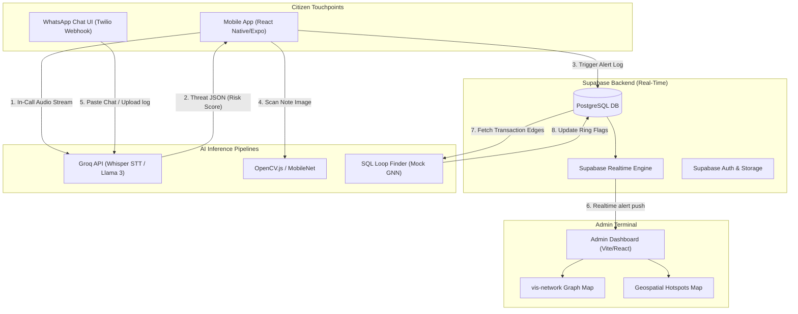

# Aligned Architecture & Implementation Plan: Mobile App + Web Admin

This updated plan pivots **RakshaNet** to a dual-application architecture:
1.  **Mobile Client App** (`/mobile`): A React Native (Expo) app for citizens to run call screening warnings, WhatsApp chat exports, and CV currency note scans.
2.  **Admin Command Center** (`/admin`): A React Vite desktop app for law enforcement and banks to inspect transaction networks and geospatial crime patterns.

---

## 1. System Architecture Diagram

This diagram shows how data flows across the mobile client, the WhatsApp webhook, the AI engines, and the Admin Command Center via Supabase.



---

## 2. Technical Stack Specifications

### 📱 A. Mobile App (React Native + Expo)
*   **Audio Capture**: `expo-av` for microphone recording access.
*   **Speech-to-Text / NLP**: Browser Web Speech API fallback, or REST API post-requests sending audio buffer segments to **Groq Whisper** and retrieving structured risk indicators from **Llama 3**.
*   **Camera Integration**: `expo-camera` to display the live feed.
*   **OpenCV.js Scanner**: Captured frame processing using canvas manipulation or canvas-based pixel checks in React Native.
*   **Alert Notifications**: `expo-notifications` for triggering out-of-band alerts on suspicious numbers.

### 💻 B. Admin Dashboard (Vite + React)
*   **Graph Network**: `vis-network` drawing account nodes, circular laundering flows, and siphoned routes.
*   **Realtime listeners**: Listening to Supabase database changes in the `alerts` table to play warning sounds and display alerts automatically on screen.

---

## 3. Revised Project Folder Structure

We will restructure the project into two distinct directories:
```
E:\ET Hacathone
├── admin/           <-- (Vite + React admin desktop panel)
│   ├── src/
│   ├── package.json
│   └── vite.config.ts
├── mobile/          <-- (React Native Expo mobile app)
│   ├── src/
│   ├── App.tsx
│   └── package.json
└── PS6_Digital_Public_Safety_Deep_Analysis.pdf
```

---

## 4. Verification Plan

### Automated / Integration Checks
1.  **Vite App Build**: Compile the admin folder code.
2.  **Expo App Scaffolding**: Ensure Expo dependencies build cleanly.

### Manual Verification
1.  **Mobile Call Simulation**: Trigger incoming call warning on the phone simulator, verify risk badge changes.
2.  **Camera Permissions**: Activate camera scanner in the Expo app, ensure camera frames are rendered.
3.  **Real-Time Alerts**: Trigger an alert on the mobile app, confirm the Admin Dashboard updates automatically.
